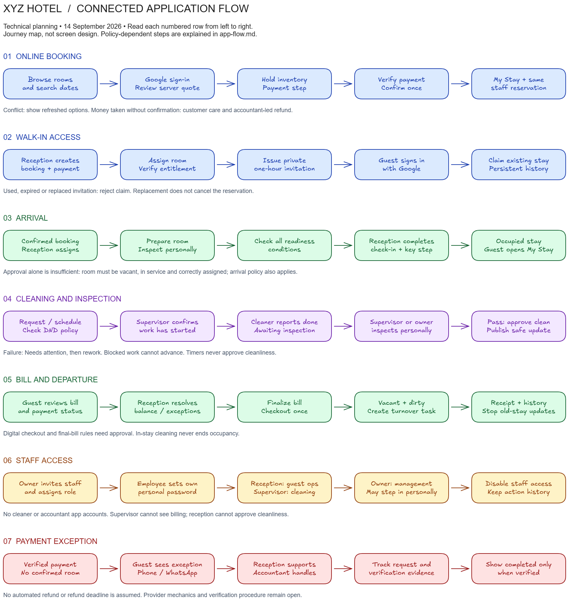

# XYZ Hotel — Application Flow

**Date:** 14 September 2026  
**Status:** Functional journey specification; not a visual design document  
**First delivery:** Real hotel pilot, confirmed on 14 September 2026  
**Authority:** [PRD v2](./prd.md) · [Decision plan](./v2-decision-plan.md)  
**Technical companions:** [Setup](./setup.md) · [Backend](./backend.md)

**UI reference:** [Desktop prototype](./prototype/index.html) · [Approval scope](./prototype/README.md). Approved on 15 September 2026 as a skeletal framework to build upon, not the final design or a resolution of open operating policies.

**Approved design boundary:** My Stay and staff operations follow the earth-palette guidelines in [design.md](./design.md), adapted to these journeys. The luxurious, promotional public website will have a different concept, still pending.

## 1. Reading the flow

The hotel has two connected product sides and three presentation contexts. Guests first discover the hotel through a luxurious, promotional public website, then use a cleaner, practical authenticated My Stay interface after proceeding with booking or returning through Google. Named staff use a private operations portal. All contexts use the same reservation, bill and verified room events. There are four app roles: Guest, Receptionist, Supervisor and Owner / Manager. Cleaners work and report in person. The accountant handles refunds through the hotel's existing process without an app account.

**Editable Excalidraw:** [Open/import the application flow](./diagrams/app-flow.excalidraw)  
**Preview:** [Full-size flow image](./diagrams/app-flow.png)

Read each diagram row from left to right. Rows are related subflows, not seven mandatory steps every guest must complete. Online booking and walk-in access converge on the same My Stay experience. Arrival connects to inspection, an occupied stay may trigger repeated service work, and checkout starts turnover for the next guest. Staff access supports the operational rows; the refund row is an exception to booking.

The diagram's colors distinguish subject areas only; they do not specify the app's branding. Policy-dependent steps below are engineering proposals or explicit gates, not newly approved hotel rules. The user confirmed a real hotel pilot; sample policies and simulated money are limited to development/test environments.

## 2. Entry points and navigation

| Entry | Access | Destination and purpose |
| --- | --- | --- |
| Hotel home `/` | Public | Discover property, contact reception, start search. |
| Rooms `/rooms` | Public | Compare types, images, capacity and amenities. |
| Amenities `/amenities` | Public | Explore the hotel's real facilities and services. |
| Offers `/offers` | Public | Review genuine configured promotions and packages. |
| Gallery `/gallery` | Public | View accurate hotel and room photography. |
| Search `/search` | Public | Dates/party and current full-stay availability. |
| Booking `/booking` | Public entry; Google sign-in when proceeding | Move from discovery into protected quote review, guest details, policy and payment option. |
| My Stay `/my-stay` | Google guest | Select own upcoming/current stay; no staff dashboard. |
| Stay `/my-stay/:id` | Linked guest | Confirmation, arrival, timeline, bill, contact and permitted actions. |
| Requests/messages `/my-stay/:id/requests`, `/messages` | Linked guest | Allowed service request and reservation conversation. |
| Account `/account` | Guest | Profile, previous stays and permitted receipts. |
| Claim `/claim-stay` | Invitation plus Google | Link an existing reception booking; never a new reservation. |
| Staff sign-in `/staff/login` | Individual staff credentials | Establish staff session, then role-based destination. |
| Operations `/staff/operations` | Reception/owner | Arrivals, departures, readiness and operational exceptions; owner sees management scope. |
| Housekeeping `/staff/housekeeping` | Supervisor/owner | Cleaning priorities, blockers, inspection and rework. Supervisor's default home. |
| Reservations, Rooms, Guests, Billing | Reception/owner; limited room view for supervisor | Staff routes under `/staff`; permissions enforced per record/action. |
| Messages and Requests | Staff according to responsibility | Supervisor gets relevant service work, not unrestricted guest conversations. |
| Team, Reports, Settings | Owner; narrowly scoped operational reports for others | Staff access, configuration and permitted oversight. |

Paths are proposed route contracts. A signed-out deep link returns the user to the intended authorized page after sign-in. Another guest's reservation reference never grants access. Expired sessions, disabled staff profiles and denied capabilities have explicit recovery messages. Call and WhatsApp contact remain visible during booking problems without requiring a confirmed stay.

## 3. Online booking and return visits

| Step | Actor and action | Authoritative outcome | Failure or alternative |
| --- | --- | --- | --- |
| G1 | Guest searches arrival/departure and party size. | Server returns feasible room options and a dated quote. | Invalid dates/capacity: field feedback. No inventory: change search. |
| G2 | Guest selects an option and continues with Google. | Server associates a stable Google identity with their guest profile. | Cancelled sign-in preserves non-sensitive search context; reception remains contact fallback. |
| G3 | Guest reviews full price, conditions and required details. | Server quote and policy version determine the submitted offer. | Expired/changed price: show revised terms and require review. |
| G4 | Guest submits once; server holds inventory and starts allowed payment step. | One pending booking and one payment attempt, using idempotency. | Conflict: refreshed options; no silent substitution. Hold duration is an open policy. |
| G5 | Backend verifies money/payment alternative and availability. | Exactly one confirmed reservation appears for staff and in My Stay. | Unknown payment: verification pending. Taken money without confirmation: refund exception below. |
| G6 | Guest returns with the same Google account. | Existing own profile and stay history appear. | No bookings: explain empty state and offer search; never attach by matching name/email alone. |

The hold-before-payment sequence is the recommended backend mechanism, subject to the selected payment policy/provider. The payment step may be simulated only during development/testing and must be labelled on both views. Pilot booking uses the approved real payment or pay-at-hotel policy. Browser success redirects cannot confirm payment on their own.

My Stay shows confirmation reference/state, dates, booked type, released room details, arrival instructions, contact, payment status, bill, safe timeline and next permitted action. Room numbers stay withheld until the configured disclosure rule allows them. No early-arrival or exact completion promise is inferred from cleaning progress.

## 4. Reception-created booking and invitation

1. Reception or owner searches the same inventory, creates the walk-in reservation and records actual in-person payment with its method/reference. A room is assigned through the shared rules.
2. Reception verifies the guest's entitlement using the procedure still to be agreed. A matching name, supplied booking reference or email alone is insufficient proof.
3. Reception issues a private one-time invitation. Its one-hour expiry applies to the invitation, not the reservation or guest account.
4. The guest opens the invitation, signs in with Google and claims the existing booking. One transaction links the guest and consumes the invitation.
5. My Stay now provides the same capabilities available to an online booker at that stay stage. History remains after departure and on later sign-in.

An expired, used or replaced invitation shows a safe explanation and a reception contact path. Reception can replace an unclaimed invitation; replacement revokes the prior one. Simultaneous claims allow one winner. A booking already linked to another identity requires staff resolution. If the guest cannot use Google, reception can still serve their stay; online My Stay access is not promised through an unapproved alternative.

## 5. Arrival, readiness and check-in

Reception opens the confirmed reservation and assigns a room that can fulfil the stay. The supervisor prepares it, confirms work progress, and personally inspects it. The owner may perform the same actions after inspecting personally. Reception sees the inspection approval separately from occupancy and maintenance.

Before showing **Room ready for check-in**, the backend checks all of the following:

- Correct current reservation/assignment and valid arrival eligibility.
- Room is vacant and in service, with no applicable block.
- Cleanliness approval is current for the room's relevant work revision.
- The hotel's configured arrival conditions permit the message/action.

Reception then performs the configured arrival/identity/key procedure and completes check-in. The room becomes occupied only after this action commits. A ready notification does not itself check the guest in or release a key.

If a block is added after a ready message, remove current readiness and provide a relevant correction/contact path. Preserve the old event in history. Room reassignment reroutes subsequent updates to the new assignment; do not publish queued updates from the former room. How reception resolves a newly unavailable committed room remains a hotel procedure to approve.

## 6. Housekeeping and in-stay requests

The normal actor is the supervisor. The owner may step in; the actual person is recorded. Cleaners do not interact with the application.

| Current state | Action and actor | Next state | Guest meaning |
| --- | --- | --- | --- |
| No task | Guest requests permitted service; reception/supervisor schedules according to policy. | Scheduled | Housekeeping scheduled; acknowledgement is not completion. |
| Scheduled | Supervisor confirms work has actually begun. | In progress | Your room is being serviced. |
| Scheduled | Scheduled start passes; reminder/delay rule applies. | Delayed | Delay when relevant; no fabricated start. |
| Delayed | Supervisor confirms start. | In progress | Your room is being serviced. |
| In progress | Supervisor records an obstacle. | Blocked | Safe delay/contact message, without sensitive internal detail. |
| Blocked | Supervisor confirms work resumed. | In progress | Servicing resumed if relevant. |
| In progress | Cleaner reports finished in person; supervisor records it. | Awaiting inspection | Your room is being checked. |
| Awaiting inspection | Supervisor/owner personally inspects and fails it. | Needs attention | Your room is still being prepared. |
| Needs attention | Supervisor directs and confirms rework. | In progress | Work continues; no completion claim. |
| Awaiting inspection | Supervisor/owner personally inspects and approves. | Approved clean | Housekeeping complete for the relevant active stay. |

Arrival readiness is separately evaluated after approval; an occupied or maintenance-blocked room cannot become ready merely because cleaning passed. In-stay cleaning leaves occupancy unchanged. Failed/revoked approval retains actor, reason and history. Cleaning undertaken after departure must not notify the previous guest.

Before accepting service work, evaluate the active stay, enabled service and DND policy. DND precedence, repeated active requests, service timing and cancellation rules remain open. The proposed behavior for repeated network submissions is to return the same request using idempotency; whether two intentional requests should merge is a separate policy decision.

Guest issue reports go to authorized staff with acknowledgement, progress and outcome. Sensitive staff notes remain private. Hotel messaging belongs to the reservation; external phone and WhatsApp links support direct contact without implying an integrated WhatsApp inbox.

## 7. Bill, checkout and turnover

The guest reviews a server-calculated bill showing itemized charges, payments, adjustments, refunds and balance. Reception sees the same financial facts; the supervisor has no billing access.

**Recommended first implementation:** guest requests checkout assistance and reception completes departure. A digital checkout control is enabled only after its eligibility and final-bill procedure are approved.

1. Reception reviews pending charges, payment verification and permitted outstanding balance.
2. Unknown payment outcomes or unresolved finalization conditions block completion with a reason.
3. Backend finalizes a bill snapshot, ends occupancy, invalidates prior cleanliness, creates one turnover task and records audit/events atomically.
4. Guest receives the permitted receipt and persistent stay history. A notification failure does not undo checkout.
5. Supervisor prepares and inspects the room for its next use. Subsequent cleaning updates do not reach the departed guest.

A retry returns the same checkout outcome. Late charges/payments require linked corrections and reconciliation; they must not silently change an already issued bill. The proposal to mark turnover dirty is a technical baseline requiring the hotel's approval of invalidation/finalization rules before implementation.

## 8. Changes, cancellations and financial exceptions

| Trigger | App behavior | Gate or invariant |
| --- | --- | --- |
| Guest requests modification | Present allowed changes and server-quoted consequences; otherwise contact reception. | Approved amendment/rate policy. |
| Reception extends stay or changes room | Recheck the whole interval and update commitment/assignment/history atomically. | No overlap, implicit split stay or silent price change. |
| Guest/reception cancels | Show policy consequences, confirm action, preserve history and release applicable future inventory. | Cancellation/refund policy; cancellation is not refund completion. |
| Reception marks no-show | Apply allowed transition and inventory/financial consequences. | Approved no-show time and policy. |
| Money taken; no confirmed room | Show payment exception and visible phone/WhatsApp; never show a fictitious booking confirmation. | Accountant-led external refund is agreed. |
| Accountant refund requested | Track request/evidence through authorized hotel staff under the agreed procedure. | No accountant login or automated transfer. |
| Completion verified | Update refund record and guest-visible financial status. | Verification procedure and timing still need approval. |

Where policies are not configured, explain that staff assistance is required rather than offer an unsafe automatic action. Missing required operating rules block the affected pilot feature. Development examples must explicitly label their sample terms and simulated payment outcomes.

## 9. Staff lifecycle and management

The owner invites a named employee and assigns Supervisor or Receptionist responsibilities. The employee sets their own password. Reception lands on guest operations; the supervisor lands on cleaning/inspections; the owner lands on management overview. Staff cannot choose or elevate their role.

The owner can perform delegated reception and supervisor work but cannot bypass room readiness, personal inspection or audit attribution. Settings control the single hotel's inventory, services, rates and later-approved policies. Reports distinguish occupied rooms, operational exceptions, collected payments and outstanding balances; collections are not automatically revenue.

Password recovery restores existing membership rather than creating a new role. Disabling an employee stops access and live updates while retaining earlier actions under that person's identity. No general shared reception password is part of the flow.

## 10. Shared interaction states

| State | Required behavior |
| --- | --- |
| Loading | Keep context; show progress; prevent duplicate consequential submission. |
| Empty | Explain whether there are no results, no stays or no tasks and give an appropriate next step. |
| Validation failure | Preserve safe input, identify the field and explain correction. |
| Conflict/stale record | Explain another update or inventory change; refetch and require review. |
| Network timeout after submit | Treat outcome as unknown; reconcile/retry with the same idempotency key. |
| Offline | Clearly label stale read data; do not accept offline approvals/payments/checkouts. |
| Saved but notification failed | Keep the saved outcome; staff may retry delivery independently. |
| Unauthorized | Require sign-in or deny access without exposing another person's information. |
| Session expired or account disabled | Close streams, clear personal cached data and stop protected actions. |

Show timestamps for verified guest updates. Do not imply an update was recorded merely because an animation or timer finished. Keyboard navigation, focus/error recovery, readable labels, screen-reader status announcements and phone usability are required across these flows.

## 11. Traceability and acceptance

| Flow | PRD requirements | PRD acceptance scenarios |
| --- | --- | --- |
| Online booking, shared inventory and retry | PR-01, PR-02, PR-03, PR-16 | 1, 2, 10, 15 |
| My Stay, safe data, messages and contact | PR-04, PR-05, PR-15, PR-20 | 9, 15, 20 |
| Scheduling, cleaning, inspection and rework | PR-06, PR-07, PR-08, PR-11, PR-18 | 3–7, 11, 13, 14, 19 |
| Role-specific operations and owner authority | PR-09, PR-10, PR-17, PR-18 | 8, 16, 19 |
| Billing, checkout, audit and delivery failures | PR-12, PR-13, PR-14 | 10, 12, 20; add explicit delivery-failure test |
| Walk-in invitation and persistent account | PR-19 | 17, 18 |

The walkthrough must also cover final-room payment conflict, expired hold with late payment, stale approval, room change with queued messages, parallel invitation claims, DND conflict and late financial updates at checkout. These scenarios are specified, not executed. No implementation, user testing or launch readiness is claimed.

## 12. Diagram maintenance

The `.excalidraw` file is the editable source; the PNG is its readable export. Open the source in Excalidraw or import it into the supplied skill's local canvas. Update source and preview together when an approved journey changes. Keep detailed policy branches in this document so the overview remains legible. The local canvas is temporary tooling; the exported files do not require a running server to retain the work.
