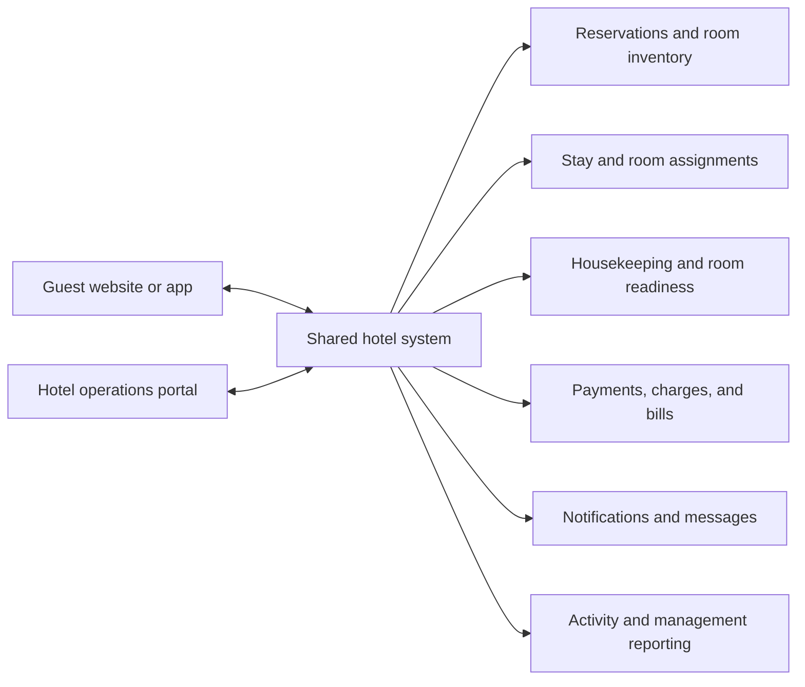
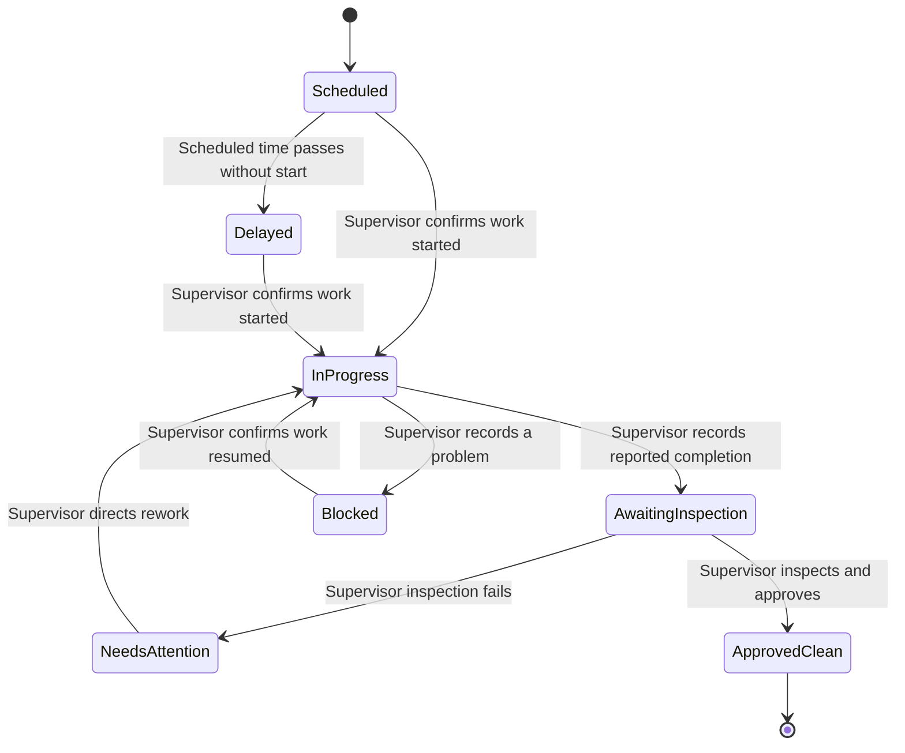

# XYZ Hotel Digital Stay Platform

## Product Requirements Document

**Version:** 2.0  
**Revision:** Owner authority, walk-in stay invitations, accountant-led refunds, and public-to-guest experience boundary  
**Updated:** 17 September 2026  
**Status:** Product concept locked for review  
**Product name:** XYZ Hotel Digital Stay Platform (working name)  
**Scope:** One hotel  
**Delivery status:** Product planning with an interactive desktop HTML prototype and an initial web/API scaffold. Connected hotel workflows have not been built or tested.  
**Prototype status:** [Approved skeletal framework](./prototype/README.md), recorded 15 September 2026. This is a starting framework to build upon, not a final design or product-policy decision. [Open prototype](./prototype/index.html).
**Design direction:** My Stay and staff operations use the approved earth-palette language in [design.md](./design.md). Screen layouts and behavior follow this PRD. The luxurious, promotional public hotel website will have a separate visual concept, still pending.

---

## 1. The idea in one minute

XYZ is a digital operating platform for one hotel. It connects the experience of booking and staying at the hotel with the work the hotel performs behind the scenes.

The platform has two connected sides:

1. **The Guest Experience** — a luxurious, promotional public hotel website where a guest discovers the property, amenities, offers and real room imagery, then searches for a room and begins booking. Google sign-in leads into a cleaner, practical authenticated My Stay experience where the guest completes permitted booking steps, views their stay, receives useful room updates, requests services, reviews their bill, and checks out.
2. **The Hotel Operations Portal** — a private workspace with distinct Owner / Manager, Supervisor, and Receptionist profiles. The owner oversees the business, the supervisor coordinates cleaners and personally approves cleanliness, and reception manages reservations and the guest journey. Cleaners perform their work without app accounts.

Both sides use **one shared hotel system**. A reservation created by a guest immediately appears to hotel staff. A real housekeeping update can become a simple status update for the correct guest. A room sold online is no longer available to reception for the same dates.

The product promise is:

> **Guests understand what is happening with their stay, hotel staff coordinate their work in one place, and managers can see how the hotel is running.**

This is not a marketplace for many hotels. It is one hotel's branded digital experience and internal operating system.

---

## 2. Why this product should exist

### Problem statement

A hotel serves the same stay through several people and processes. A guest makes a reservation. Reception prepares for the arrival. A supervisor coordinates the room. Housekeeping cleans it. Staff record charges and payments. The manager needs to know whether all of this is working.

When these activities are separated, staff can lose the shared picture and guests are left asking questions such as:

- Is my reservation confirmed?
- Has the hotel assigned my room?
- Is the room ready for me?
- Was my housekeeping request received?
- What have I paid, and what is still due?
- Who should I contact if something changes?

XYZ gives the hotel one operational record and gives the guest a safe, understandable view of the parts relevant to their stay.

### The opportunity

Established travel and hotel products already teach guests to expect digital booking, trip details, messages, check-in controls, service requests, room-ready alerts, bills, and checkout. XYZ combines these familiar patterns for one hotel and connects them directly to its staff workflow.

Its distinctive idea is **verified operational transparency**: when hotel staff perform and record real work, the system can automatically show the guest a useful update. The system distributes the update; it does not pretend that work happened.

### Who it is for

| Actor | What they need |
| --- | --- |
| Guest | A simple way to book, prepare for, manage, and understand their stay |
| Receptionist | One place to manage reservations, arrivals, check-ins, room assignments, bills, and departures |
| Supervisor | Coordinate cleaners in person, inspect completed work, update room condition, and resolve operational issues |
| Owner / Manager | Oversee the business, finances, policies, staff access, and major exceptions |
| System | A reliable way to keep inventory, reservations, service work, payments, and notifications synchronized |

---

## 3. Product model

### One platform, two experiences



The guest and staff interfaces are different because their jobs are different. They must never become two disconnected products.

### What is shared

- Hotel and room information
- Room types and date-based availability
- Guest and reservation records
- Room assignments and stay status
- Housekeeping tasks and approved guest-facing statuses
- Service requests
- Charges, payments, and bills
- Messages and notification history
- Staff actions and audit history

### What stays private

Guests see only their own reservations and approved stay information. They do not see staff identities, internal notes, other guests, room-security information, task-performance data, or the hotel's private reports.

Supervisors see room, cleaning, inspection, and service-request information needed for their work. They do not need guest financial records or broad personal information. Cleaners have no app access. The owner and receptionists receive access according to their responsibilities.

---

## 4. The Guest Experience

### Guest navigation

| Area | Purpose |
| --- | --- |
| Home / Find a Room | Sell the hotel experience through a luxurious landing page and begin a date-and-guest search |
| Rooms | Compare room types, capacity, amenities, images, and available offers |
| Amenities | Present the facilities and services that make the property desirable |
| Offers | Present genuine configured promotions or packages without inventing unapproved prices or terms |
| Gallery | Show real hotel and room photography with accurate captions |
| Booking | Enter guest details, review the stay, accept policies, and pay or choose an allowed payment option |
| My Stay | The guest's main post-booking dashboard |
| Requests and Messages | Request available services and communicate with the hotel |
| Account | Sign in with Google to return to current and previous stays, receipts, and personal details |

### Approved experience boundary and design direction

The public hotel website and My Stay are related parts of one guest journey, but they serve different purposes and should not look or behave like the same screen shell. The public side is image-led, luxurious and promotional: it advertises the hotel, amenities, offers and rooms and leads the guest toward availability and booking. My Stay is a cleaner, more practical application interface focused on trusted reservation information and the guest's next action.

Guests may browse public content, rooms and availability without an account. Google sign-in is required when the guest proceeds with booking, claims a reception-created booking, or opens protected My Stay information. The public site, My Stay and staff portal may be implemented as distinct route groups and layouts in the same web application; authentication and backend authorization, rather than visual separation alone, protect private data.

The later approved earth-palette reference supplies the visual language for My Stay and staff operations; see [design.md](./design.md). Adapt it to the actual product workflows rather than copying the demo's layout or sample logic. The original prototype remains a skeletal functional reference. The public hotel website requires its own separate design concept.

### Guest sign-in and returning visits

Guests may browse the hotel, room types, and availability without signing in. When booking or opening My Stay, **Continue with Google** is the agreed primary sign-in route. Returning with the same Google account opens the same guest profile and its reservation history, without requiring a separate hotel password.

The profile supports convenient return visits; retention depends on useful stay information and good service as well as easy access. Guest sign-in never grants staff access. Guests see only bookings associated with their own profile. Reception continues to serve walk-ins; linking a reception-created booking to an online profile requires confirmation of the guest's entitlement to that booking. An alternative email sign-in route may be considered later and is not a requirement of this agreement.

### Reception-created booking and stay invitation

Reception creates a walk-in booking, records the in-person payment and assigns a room using the existing reservation workflow. After verifying the guest's entitlement, reception gives them a private one-time stay invitation. The guest signs in with Google and claims that booking into a regular persistent guest account, with the same My Stay capabilities as an online booker at the same stay stage.

The invitation expires on successful claim or one hour after issue. Reception can issue a replacement if needed, invalidating the previous invitation. Expiry or replacement does not cancel the booking or remove its history. Only the invitation is temporary; the account and booking history persist. The exact entitlement-verification procedure remains to be specified. An accountant app role is not introduced by this workflow.

### My Stay: the centre of the booked experience

After booking, the guest lands on **My Stay**, not on the hotel's staff dashboard. It should answer the most important questions without making the guest search through the app.

My Stay contains:

- Confirmation status and reservation reference
- Hotel address, contact details, directions, and arrival instructions
- Check-in and checkout dates and the hotel's stated times
- Booked room type and, when the hotel allows it, assigned room information
- Payment status, amount paid, amount due, and access to the bill or receipt
- A simple stay timeline showing meaningful updates
- Check-in action when digital or pre-arrival check-in is supported
- Housekeeping preference and available service requests
- Message the hotel
- Modify or cancel options allowed by hotel policy
- Checkout action and final bill when supported

### Guest journey


### Guest flow: search and book

1. Guest selects arrival date, departure date, and number of guests.
2. The system returns room types the hotel can fulfil for the whole stay.
3. Guest compares the room description, capacity, amenities, images, price, and relevant conditions.
4. Guest selects an option, signs in with Google if needed, and confirms the required personal details.
5. Guest reviews the full booking summary and the hotel's configured policies.
6. Guest completes an available payment step or selects an allowed alternative.
7. The system verifies availability again, creates one reservation, and displays confirmation.
8. The same confirmed reservation appears in the staff portal.
9. The guest receives confirmation through the configured notification channel and can open My Stay.

If availability changes before confirmation, the system must explain the conflict and show updated alternatives without silently changing the selected room or price.

### Guest flow: before arrival

The guest uses My Stay to confirm details, provide an estimated arrival time, select available preferences, review what remains to be paid, read arrival instructions, and contact the hotel.

When a physical room is assigned, the guest sees only the information the hotel has chosen to release. The exact rule for when room numbers are revealed will be defined with the hotel's security and check-in policy.

Room readiness can appear as a small part of the stay timeline:

- **Reservation confirmed**
- **Preparing for your arrival**
- **Room ready for check-in**

The guest should not be encouraged to travel early unless the hotel explicitly marks the room ready and its policy permits early arrival.

### Guest flow: during the stay

The guest can view current stay details, access the bill, message the hotel, and use the services enabled by the hotel. Housekeeping is the first service workflow in the concept.

Depending on the hotel's later policy, the guest may:

- Select a housekeeping preference
- Request housekeeping
- Choose Do Not Disturb for an allowed period
- See whether a request is scheduled, in progress, completed, delayed, or unable to proceed
- Report a room issue

The guest sees a clear service update, not a live map of an employee and not the hotel's internal notes.

### Guest flow: checkout

The guest reviews the latest bill and payment status. If the hotel supports digital checkout and the account is eligible, the guest confirms departure and receives a final receipt. If staff assistance is required, the guest is attended to at reception.

---

## 5. The Hotel Operations Portal

### Staff navigation

| Area | Primary users | Purpose |
| --- | --- | --- |
| Operations | Owner / Manager, Supervisor, Receptionist | Role-appropriate arrivals, departures, room readiness, and urgent exceptions |
| Reservations | Manager, receptionist | Reservation list, search, room calendar, booking details, modifications, and cancellations |
| Rooms | All staff with role-appropriate detail | Occupancy, readiness, maintenance condition, upcoming stays, and room history |
| Housekeeping | Supervisor; owner oversight and operational access | Cleaning priorities, progress, rooms awaiting inspection, inspection outcomes, and reported issues |
| Guests | Manager, receptionist | Guest profiles, contacts, current stay, and permitted history |
| Billing | Manager, receptionist | Charges, payments, balances, receipts, refunds, and exceptions according to permission |
| Messages and Requests | Owner / Manager, Receptionist; Supervisor for relevant service requests | Guest conversations and operational requests according to responsibility |
| Team | Owner / Manager | Individual staff accounts, roles, and access |
| Reports | Manager | Occupancy, room readiness, reservations, collections, outstanding balances, and operational activity |
| Settings | Manager | Hotel information, rooms, rates, policies, services, and notifications |

**Operations** replaces the ambiguous idea that “Today” is the centre of the whole application. It is the main daily workspace for hotel staff only.

### Owner / Manager experience

The owner uses the management view to understand the hotel's current state without opening every reservation. This is distinct from the supervisor's inspection and coordination role. The overview should show:

- Occupied, vacant, ready, dirty, cleaning, and unavailable rooms
- Today's expected arrivals and departures
- Rooms that may delay a guest arrival
- Open guest requests and overdue housekeeping work
- Reservation changes and cancellations requiring attention
- Payment or balance exceptions
- Maintenance issues affecting room availability
- A traceable activity history showing who changed important records

The manager can configure staff access, room inventory, available services, and later-defined hotel rules. The dashboard should direct attention to exceptions and decisions rather than becoming a wall of decorative charts.

### Receptionist experience

Receptionists manage the guest's operational journey. They can:

- Create a reservation for a guest or walk-in
- Find and review reservations made through the guest experience
- Assign or change a physical room according to availability
- Check the supervisor's or owner's cleanliness approval and other readiness conditions, then complete check-in
- Record allowed payments and charges
- Receive and route guest requests
- Extend or amend a stay under hotel policy
- Review the bill and complete checkout
- Cancel or mark a no-show under hotel policy

### Supervisor experience and physical cleaning work

The supervisor has a focused mobile workspace for rooms needing cleaning, service requests, priorities, maintenance issues, and inspections. They direct cleaners in person and record operational progress in the app. Cleaners clean the rooms and report completion to the supervisor in person; they do not sign in, claim tasks, or update software.

After cleaning is reported finished, the supervisor records **Awaiting inspection** and personally checks the room. If work is unsatisfactory, they record **Needs attention** and direct rework. Only a successful in-person inspection permits **Approve as clean**. The app records the supervisor and approval time and updates reception and the relevant guest automatically.

The operating assumption is that the paid supervisor is available to perform this responsibility. The owner can perform the operational actions delegated to reception and the supervisor, including cleanliness approval after personally inspecting the room. These remain delegated day-to-day duties, not the owner's main task. Owner authority does not bypass physical inspection, readiness conditions, or attributable activity history.

### Staff profiles and access

The owner creates or invites named Supervisor and Receptionist accounts and assigns their roles. Each employee sets their own password and uses their own profile; staff do not share a general reception or supervisor password. Role determines the home screen, visible information, and permitted actions.

The owner lands on the management overview, the supervisor on cleaning and inspections, and the receptionist on daily guest operations. Staff cannot choose or promote their own role. The owner can change assigned responsibilities or disable an account when an employee leaves; historical actions retain the original person's attribution. Password recovery restores the person's existing access without changing their role.

---

## 6. Verified operational transparency

### Core rule

The system may automate the **distribution** of a status, but it must not fabricate the underlying event.

A configured schedule or supervisor instruction means the service is scheduled. It does not mean cleaning has started. The supervisor records progress based on what they have confirmed in person. A timer can remind the supervisor about work; it cannot declare a room clean. Cleanliness approval always requires an in-person inspection by the supervisor or the owner stepping in, followed by that same person's update in the app.

**Cleanliness approval and readiness for check-in are separate.** An inspected room may still be occupied or blocked for maintenance. Reception can check a guest in only when cleanliness is approved and the other readiness conditions are satisfied. Cleaning during an active stay does not end occupancy.

The supervisor remains the normal actor in the flow, translation table and example below. The owner may perform the same actions when stepping in, with the actual actor recorded. Neither role can approve without personally inspecting.

### Housekeeping status flow



### Translation from staff detail to guest language

| Internal state or event | Guest-facing status | Guest notification? |
| --- | --- | --- |
| Service scheduled by policy or supervisor | Housekeeping scheduled | Usually shown in My Stay; notification optional |
| Task assigned internally | No additional detail | No |
| Supervisor confirms cleaning has started | Your room is being serviced | Optional, based on guest preference |
| Cleaner reports finished; supervisor records awaiting inspection | Your room is being checked | Usually visible in My Stay; no completion notification |
| Supervisor inspects and approves the room as clean | Housekeeping complete | When enabled for the relevant active stay |
| Cleanliness approved and all arrival readiness conditions satisfied | Your room is ready for check-in | Yes |
| Supervisor finds further work needed | Your room is still being prepared | Notify only if it affects a promise to the guest |
| Task is delayed | There is a delay; the hotel is handling it | Yes when the delay affects a promise to the guest |
| Staff reports a sensitive or operational issue | A hotel team member is handling your request | Only when the guest needs to know |

### Privacy and trust rules

- Only the guest connected to the reservation can see its stay and service statuses.
- Do not expose the housekeeper's identity, live location, performance metrics, internal notes, or details of another room.
- Display a timestamp such as “Updated 2:18 PM” so the guest understands how fresh the status is.
- Do not promise an exact completion time unless the hotel has intentionally provided one.
- If a staff update is reversed, delayed, or incorrect, show the corrected state and preserve the internal activity history.
- Failed notification delivery must not reverse the hotel action or duplicate a task.
- Approval records identify the actual approving supervisor or owner internally; guests see the service outcome and update time. A reported finish, failed inspection, or elapsed timer must never produce a clean or complete message.
- Updates belong to the relevant stay. A departed guest does not receive later cleaning updates merely because they previously occupied that room.

### Example

1. Client A has an active stay in Room 123 and is away from the hotel.
2. Hotel policy or the supervisor schedules housekeeping for the room.
3. My Stay shows **Housekeeping scheduled**.
4. The supervisor confirms cleaning has started and updates the app. My Stay changes to **Your room is being serviced**.
5. The cleaner reports completion to the supervisor. The supervisor records **Awaiting inspection**; the guest sees **Your room is being checked**.
6. The supervisor inspects the room in person. If more work is needed, they direct rework without marking the room clean.
7. Once satisfied, the supervisor selects **Approve as clean**. The relevant guest sees **Housekeeping complete** and may receive a notification.
8. The owner and receptionist see the recorded approval and operational details appropriate to their roles. The cleaner has used no software.

This flow reassures the guest without requiring the manager to manually message them at every step.

---

## 7. Shared product capabilities

### Hotel and room inventory

- Configure one hotel's identity, contact information, location, timezone, currency, and operating settings.
- Create configurable room types such as Standard, Deluxe, Family Suite, and Business Suite.
- Manage physical rooms separately from room types.
- Track date-based reservation availability separately from current occupancy, housekeeping readiness, and maintenance condition.
- Prevent conflicting reservations for the same inventory.

### Reservations

- Search availability from either the guest or staff side using the same inventory.
- Create, confirm, modify, cancel, check in, check out, and retain reservation history.
- Support reservations created by guests, receptionists, and authorized managers.
- Record the source and responsible actor for important changes.
- Keep guest-facing and staff-facing status labels consistent with the same underlying reservation state.

### Stay and room assignments

- Connect a reservation to its booked room type and, when assigned, a physical room.
- Retain room-change history.
- Prevent check-in to an occupied, unready, or unavailable room.
- Keep future availability separate from immediate readiness.
- Support physical room assignment before arrival or at check-in according to later hotel policy.

### Housekeeping and service requests

- Create scheduled or guest-requested tasks.
- Let the supervisor prioritize work and direct cleaners in person.
- Let the supervisor record start, blockers, resumption, reported completion, inspection, and required rework.
- Require personal inspection and approval by the supervisor or the owner stepping in before showing a room as clean or housekeeping as complete.
- Update room readiness when the task type should affect it.
- Translate selected operational events into guest-facing statuses.
- Notify the manager or reception when a delay or issue affects a guest.

### Charges, payments, and bills

- Show the guest the price and configured conditions before booking.
- Track room charges, service charges, payments, refunds, adjustments, and balance.
- Provide a clear bill and payment receipt.
- Keep financial changes attributable and recoverable through recorded corrections rather than silent overwrites.
- Distinguish recording an externally collected payment from processing money through an integrated payment provider.

Exact rate calculation, taxes, deposits, cancellation charges, accepted methods, settlement rules, payment providers and detailed refund procedures remain later business decisions. Accountant responsibility and the refund outcome for charged-but-unconfirmed bookings are agreed below.

A charge is an amount added to the guest's bill; a payment records money paid against that bill. Explaining charges does not add new paid services to scope.

If a guest is charged but a competing booking wins the last available room, the agreed resolution is a refund handled by the hotel's accountant through the existing hotel hierarchy. Reception/customer care supports the guest through calls and WhatsApp. This agreement does not introduce an accountant app account, automated refund processing, or an accounting integration. Refund timing, provider mechanics, verification and tracking remain to be specified; a request for a refund must not be presented as a completed refund.

### Messages and notifications

The guest-facing contact path includes a visible hotel/reception customer-care phone number and WhatsApp contact so guests can call or message to verify issues, including booking and refund problems. This is a contact fallback, not a requirement for automated WhatsApp notifications or an integrated support system.

- Confirm important reservation events.
- Send approved room-ready and service updates.
- Support guest-hotel messaging associated with the reservation.
- Allow notification preferences where the hotel can safely make alerts optional.
- Show delivery failures to staff and allow a retry that does not repeat the underlying booking or task action.

### Management and reporting

- Provide real-time operational counts from the shared system.
- Show exceptions that need human action.
- Preserve an audit trail for important reservation, room, financial, housekeeping, and permission changes.
- Keep operational activity, collected payments, outstanding balances, and later-defined revenue measures clearly distinguished.

---

## 8. Core states and rules

### Reservation lifecycle

```text
Pending → Confirmed → Checked in → Checked out
Pending → Expired
Confirmed → Cancelled
Confirmed → No-show
```

The payment flow that leads from Pending to Confirmed will be defined with the hotel's later payment policy. The system must not sell the same inventory twice while two users or staff members attempt to confirm it.

### Separate room facts

A single “room status” is not enough. The system tracks at least four separate facts:

1. **Reservation availability:** Is the room inventory committed for the requested dates?
2. **Occupancy:** Is someone physically checked into the room now?
3. **Cleaning and inspection:** Does the room need cleaning, have cleaning in progress, await inspection, need rework, or have supervisor or owner approval as clean?
4. **Operational condition:** Is it in service, blocked, or unavailable because of maintenance?

A room can be vacant but dirty. It can be clean but reserved for a later arrival. It can be occupied and have housekeeping scheduled. It can be clean but unavailable because of maintenance.

### Source-of-truth rules

- The shared hotel system decides authoritative availability and totals; browser interfaces display its result.
- A guest and receptionist must receive the same availability outcome for the same request.
- Consequential actions recheck the current record before saving.
- Repeated confirmation, payment, checkout, or completion requests must not create duplicates.
- Staff actions use individual accounts and role permissions.
- Guest-facing status is derived from an approved internal event, not maintained as an unrelated second record.

---

## 9. Roles and permissions

| Capability | Guest | Receptionist | Supervisor | Owner / Manager |
| --- | --- | --- | --- | --- |
| Search and create own booking | Yes | On behalf of guest | No | Yes |
| View reservation | Own only | Yes | Limited stay context needed for room work | Yes |
| Modify or cancel reservation | Own, subject to policy | Yes | No | Yes |
| Assign room and check in/out | Allowed guest steps only | Yes | No | Yes |
| View guest bill | Own only | Yes | No | Yes |
| Process or record payment | Own booking flow | According to policy | No | Yes |
| Request housekeeping | Own active stay | On behalf of guest | No | Yes |
| Schedule and update cleaning progress | View translated status | Submit request and view | Yes | Yes; delegated to supervisor day to day |
| Inspect and approve cleanliness | No | View approval only | Yes, after personal inspection | Yes, after personal inspection |
| View internal notes | No | According to responsibility | Relevant room and task notes | Yes |
| Configure hotel, rooms, staff, policies | No | No | No | Yes |
| View hotel reports | No | Limited shift information | Cleaning, inspections, and operational issues | Yes |
| Create staff accounts and assign roles | No | No | No | Yes |

There is no cleaner app role. A supervisor cannot access guest billing or grant themselves owner permissions. The owner can perform delegated reception and supervisor actions. Cleanliness approval requires personal inspection by the approving supervisor or owner; receptionists cannot approve cleanliness.

Permissions must be enforced by the backend as well as hidden or disabled in the interface.

---

## 10. Conceptual information model

These are product concepts, not a final database design or mandatory inheritance hierarchy.

| Entity | Responsibility |
| --- | --- |
| Hotel | The single property's identity, location, settings, policies, and services |
| RoomType | Sellable category, capacity, amenities, images, and pricing inputs |
| Room | A physical room number with readiness and operating condition |
| Guest | Google-linked customer profile, permitted contact information, and associated stay history |
| Reservation | Dates, guest party, booked room type, status, pricing snapshot, and source |
| RoomAssignment | The physical room allocated to a reservation for a period |
| Stay | Actual check-in, occupancy, and checkout information |
| HousekeepingTask | Room work coordinated and recorded by the supervisor, including progress, blockers, awaiting inspection, and rework |
| Inspection / Approval | Approving supervisor or owner identity, room and relevant work, inspection outcome, approval time, and corrections |
| ServiceRequest | A guest or staff request associated with a stay |
| Folio / Bill | Charges, payments, refunds, adjustments, and balance for a reservation |
| StaffAccount and Role | Individual Owner / Manager, Supervisor, or Receptionist profile, assigned access, and active status |
| Notification | Guest or staff message, delivery channel, status, and retry history |
| AuditEvent | Who changed an important record, when, and why where required |
| KeyAssignment | Optional physical or digital key record; detailed integration is later scope |

### Mapping from the original OOD

| Original OOD concept | Product interpretation |
| --- | --- |
| Hotel | The property and its configuration |
| Room | Split into RoomType and physical Room so sales and operations are clear |
| RoomBooking | Reservation plus room assignment and stay lifecycle |
| RoomKey | Optional key assignment; hardware integration is not assumed |
| HouseKeeping | Supervisor-managed cleaning work, mandatory in-person inspection, and approved cleanliness |
| RoomCharge and Invoice | Guest folio, charges, payments, and bill |
| Notification | Reservation, arrival, readiness, service, and cancellation communication |
| Account, Person, Guest, Receptionist, Manager, Housekeeper | Four app roles: Owner / Manager, Supervisor, Receptionist, Guest. Cleaners remain physical hotel workers without accounts |

---

## 11. Experience and design direction

### Overall character

The product should feel trustworthy, calm, clear, and responsive. It serves a guest planning a stay and staff working through a busy shift. The two interfaces may have different density, but they should feel like parts of the same hotel brand.

### Guest experience principles

- Lead with the hotel, available rooms, and the next useful action.
- Make price, dates, guest count, room choice, payment state, and policies easy to review.
- Use My Stay as one dependable home for the booked journey.
- Use plain language such as **Housekeeping scheduled** and **Room ready for check-in**.
- Make timestamps and notification preferences clear.
- Give the guest a direct path to contact the hotel when automation is insufficient.
- Do not expose internal operational complexity as a novelty feature.

### Staff experience principles

- Prioritize scanning, speed, and exception handling.
- Make the next action and blocked reason obvious.
- Preserve context when staff move between a reservation, room, bill, and task.
- Make the supervisor's cleaning and inspection workflow usable on a phone with large targets and clear approval actions.
- Pair every status colour with a label or icon.
- Show loading, empty, stale, offline, failure, and access-denied states honestly.

### Accessibility and responsiveness

Core flows must work with keyboard navigation, visible focus, labelled controls, readable contrast, screen-reader announcements for meaningful status changes, and non-colour status cues. The guest experience and housekeeping workflow must work at phone width. Staff tables and calendars must provide usable compact or list alternatives.

---

## 12. First-release scope

The first coherent release must demonstrate the connection between guest experience and hotel operations. It should not be reduced to only a staff dashboard or only a booking website.

### Included

**Guest side**

- Hotel and room discovery
- Google sign-in and a persistent personal guest profile
- Private one-time, one-hour invitations to claim verified reception-created bookings into persistent guest accounts
- Date-based availability search
- Reservation creation and confirmation
- A configurable payment step or clearly labelled development substitute
- My Stay dashboard
- Reservation details and allowed cancellation path
- Arrival information
- Housekeeping preference or request
- Verified housekeeping and room-ready status updates
- Hotel messaging/contact path with visible customer-care phone and WhatsApp contact
- Bill and checkout flow at the level enabled by the selected policy

**Hotel side**

- Individual Owner / Manager, Supervisor, and Receptionist accounts with role-specific access
- Operations overview
- Reservation list, search, calendar, and details
- Staff-created reservations
- Room assignment and check-in/out
- Room occupancy, readiness, and maintenance visibility
- Supervisor-managed cleaning queue, mandatory inspection, and approved guest-status updates
- Guest request handling
- Basic charges, payments, balances, and receipts
- Configuration and activity history needed to operate the demonstration safely

**Shared system**

- One source of truth for rooms and reservations
- Role-based access
- Concurrency protection against duplicate bookings
- Event-driven guest-status translation
- Notification delivery tracking
- Responsive and accessible core flows
- Backup and recovery appropriate to the chosen deployment before any real hotel pilot

### Later iterations

- Multiple hotels or marketplace discovery
- Channel-manager integrations with external travel sites
- Loyalty programme
- Restaurant, spa, minibar, or full point-of-sale integrations
- Payroll and human-resources management
- Dynamic pricing and advanced revenue management
- Full accounting integration
- Digital door-key hardware
- Guest live-location or employee tracking
- Complex group bookings and corporate accounts
- Native mobile applications if a responsive web experience is insufficient

---

## 13. Decisions deliberately left for later

The concept is locked without inventing hotel policy. These decisions must be made before their affected features are implementation-ready:

| Decision area | Questions to resolve |
| --- | --- |
| Room sales | Does the guest book a room type or choose an exact room? When is a room number revealed? |
| Pricing | Nightly rates, date changes, promotions, extra guests, extensions, and room upgrades |
| Payment | Provider, currency, deposits, authorizations, pay-now versus pay-at-hotel, accepted methods and refund timing/verification/tracking. Accountant-led refunds for charged-but-unconfirmed bookings are agreed |
| Fees and tax | Applicable jurisdiction, calculation, display, invoice wording, and reporting |
| Cancellation and no-show | Deadlines, penalties, credits, and manager exceptions |
| Check-in and keys | Identity checks, arrival time, pre-check-in, physical keys, and possible digital-key integration |
| Housekeeping | Daily schedule, opt-in or opt-out policy, Do Not Disturb rules, inspection checklist, and service-level expectations. In-person inspection is mandatory; the supervisor normally approves, and the owner may personally inspect and approve |
| Notifications | Automated delivery channel, consent, quiet hours, and which updates are optional. Phone and WhatsApp customer-care contact are agreed; automated WhatsApp integration is not implied |
| Data and hosting | Deployment location, retention, privacy obligations, backup objectives, and outage process |
| Business model | Internal hotel project, portfolio demonstration, or commercial product for independent hotels |

Until a rule is approved, prototypes should use clearly labelled sample policies and avoid presenting them as universal hotel practice.

---

## 14. Requirements and acceptance scenarios

### Product requirements

| ID | Requirement |
| --- | --- |
| PR-01 | A guest and staff member querying the same dates must use the same room inventory and receive a consistent availability result. |
| PR-02 | A successful guest booking must appear in the hotel operations portal without manual re-entry. |
| PR-03 | Concurrent attempts must not create conflicting reservations or duplicate payments. |
| PR-04 | My Stay must present confirmation, dates, booked room information, payment state, hotel contact, and relevant next actions. |
| PR-05 | A guest can see only their reservations and guest-approved operational statuses. |
| PR-06 | Housekeeping updates must follow explicit task transitions and retain the staff-side activity history. |
| PR-07 | Guest-facing housekeeping or readiness statuses must be derived from internal events and cannot advance solely because a timer elapsed. |
| PR-08 | A meaningful housekeeping or readiness change must update the operations view and the correct guest's My Stay view. |
| PR-09 | Managers must see room, reservation, housekeeping, request, and financial exceptions that require action. |
| PR-10 | Receptionists must manage the operational reservation-to-checkout journey according to configured policy. |
| PR-11 | The supervisor must coordinate cleaning and record personal inspection approval from a phone. Cleaners need no accounts, and reported completion alone cannot publish a clean status. |
| PR-12 | Charges, payments, refunds, and balance must be understandable to authorized staff and the relevant guest. |
| PR-13 | Important actions must record the actor and time; sensitive corrections must preserve history. |
| PR-14 | A failed notification must not undo or duplicate the booking, payment, or housekeeping action that triggered it. |
| PR-15 | Guest and staff interfaces must provide honest loading, failure, offline or stale, empty, and permission states. |
| PR-16 | Guests can browse without signing in and use Google sign-in to book or return to their own My Stay profile and history. |
| PR-17 | The owner controls individual staff accounts and assigned roles. Staff set their own passwords, cannot promote themselves, and lose access when their profile is disabled. |
| PR-18 | The Supervisor or Owner / Manager role can approve cleanliness only after personally inspecting in person. This is normally the supervisor's duty. Each approval identifies the actual approver and time; readiness for check-in also requires the other room conditions to be satisfied. |
| PR-19 | A verified guest can claim a reception-created booking through Google sign-in and a private one-time invitation. It expires on claim or after one hour; a replacement invalidates the old invitation without changing the booking. The guest account and history persist. |
| PR-20 | Guest contact information must include customer-care phone and WhatsApp access. Refunds for charged-but-unconfirmed bookings are handled by the accountant through existing hotel operations; the product must not claim completion before it is verified. |

### Acceptance scenarios

1. A guest books an available room option. Confirmation appears in My Stay and the same reservation appears in the staff portal.
2. A guest and receptionist attempt the final available room for overlapping dates. Only one confirmation succeeds; the other receives refreshed options.
3. A supervisor schedules housekeeping. Staff see the task and the guest sees **Housekeeping scheduled**, not **Cleaning in progress**.
4. The supervisor confirms that cleaning has started and records it. The operations portal updates and only the relevant guest sees **Your room is being serviced**.
5. Fifteen minutes pass without completion. The system reminds or escalates to staff but does not tell the guest that cleaning is complete.
6. A cleaner reports completion in person. The supervisor records **Awaiting inspection**, and no clean or complete message is sent. After inspecting and approving, the supervisor's identity and time are recorded; the relevant guest sees **Housekeeping complete** and receives a notification when enabled.
7. A housekeeping blocker affects the promise to the guest. Staff see the detailed reason and the guest sees an appropriate delay message with a contact path.
8. A supervisor attempts to open guest billing or change staff roles. Access is denied. A receptionist can view cleanliness approval but cannot issue it. The owner can issue approval after personally inspecting, with their own identity and time recorded.
9. A guest opens My Stay and sees accurate booking, payment, arrival, request, and hotel-contact information without internal staff notes.
10. A payment or booking submission is retried after a timeout. The system returns the existing result instead of creating a duplicate.
11. A room is vacant but dirty. It may be available for a future date but cannot be represented as ready for immediate check-in.
12. The guest completes an eligible checkout. Staff occupancy, room-readiness work, guest bill, and stay history update consistently.
13. An inspection fails. The supervisor directs rework, the room remains unapproved, and the guest is not told that housekeeping is complete.
14. A room passes cleaning inspection but has an unresolved maintenance block. Reception sees the approval and block separately; no ready-for-check-in message is issued.
15. A guest returns through the same Google account. They see their existing profile and bookings, without a separate hotel password or access to anyone else's stays.
16. The owner creates a receptionist profile. The employee sets a personal password and sees reception functions. Disabling that profile removes access while preserving their earlier activity records.
17. Reception records a walk-in booking, in-person payment and room assignment, verifies entitlement and issues a private invitation. The guest signs in with Google and claims the existing booking without duplication, gaining the My Stay capabilities appropriate to that stay stage.
18. A claimed or hour-old invitation cannot be used. Issuing a replacement invalidates the old invitation. The booking remains intact, and successful claim retains a persistent account and history.
19. The owner steps in to perform delegated reception or supervisor work. They personally inspect before approving cleanliness; approval records the owner and time. Owner access does not make an occupied or maintenance-blocked room ready for check-in.
20. A guest charged without a confirmed booking can find the customer-care phone and WhatsApp contact. The accountant handles the refund through the hotel process; no unavailable booking or unverified completed refund is shown. Detailed refund timing and reconciliation are verified against the later-approved procedure.

---

## 15. Success measures

Initial targets will be finalized after prototype testing and real hotel discovery. The product should measure:

- Percentage of online bookings completed successfully
- Booking conflicts or duplicate commitments, with a target of zero
- Percentage of active guests who use My Stay
- Percentage of cleaning jobs with a recorded inspection and outcome by the supervisor or owner
- Difference between displayed guest status and actual operational state
- Time from guest service request to staff acknowledgement and completion
- Time required for reception to find and act on a reservation
- Number of guest enquiries that My Stay resolves without staff intervention
- Manager ability to identify delayed rooms, unresolved requests, and financial exceptions
- Guest trust and usefulness ratings for stay updates

The product must not claim reduced workload, faster rooms, increased bookings, or greater guest satisfaction until those outcomes are measured.

---

## 16. Risks and safeguards

| Risk | Why it matters | Safeguard |
| --- | --- | --- |
| Reported cleaning is mistaken for approved cleanliness | The guest could be told the room is clean before it is inspected | Require the approving supervisor or owner to inspect in person and record approval; preserve awaiting-inspection and rework states |
| Automatic timing creates false claims | Guests lose trust and may return before the room is ready | Timers remind the supervisor; only an in-person inspection approval by the supervisor or owner confirms cleanliness |
| Too much operational detail reaches guests | Privacy, safety, and unnecessary anxiety | Translate internal events into a small approved guest vocabulary |
| Two interfaces drift apart | Staff and guests act on different information | One shared backend, one reservation record, and derived guest statuses |
| Guest expects every hotel action to be trackable | Scope and notification noise grow quickly | Limit tracking to useful promises and requested services |
| Complex hotel policies are invented too early | The design may encode the wrong business | Keep policy configurable and resolve it with a real target hotel before production |
| Staff portal becomes overcrowded | Daily work slows down | Role-specific navigation and exception-focused dashboards |
| Payment feature overstates its capability | Guest may believe money was moved when it was only recorded | Clearly distinguish payment processing, authorization, and manual records |

---

## 17. Product references

These products are references for familiar interaction patterns. XYZ is not intended to copy their entire scope.

| Product | Verified public capability | What XYZ should learn from it |
| --- | --- | --- |
| Airbnb | Trip details, check-in instructions, reservation-linked messaging, and automated messages triggered around booking, check-in, and checkout | Keep post-booking information and communication organized around one stay |
| Hilton Honors | Digital check-in, arrival time, and the choice to select a room or let the hotel assign one | Let guests prepare for arrival while preserving hotel control |
| IHG | Digital check-in, arrival-time collection, room-ready alerts, bill review, and digital checkout at participating hotels | Room-ready updates are valuable when they lead to a clear guest action |
| World of Hyatt | Booking, check-in preferences, housekeeping preferences, digital keys, messaging/support, and bill access at participating hotels | Treat the stay as a controllable digital journey, not only a reservation |
| Marriott Bonvoy | Housekeeping preferences, in-app housekeeping and amenity requests, mobile checkout, and access to stay information | Connect service requests to the active stay and keep them easy to reach |

Official references checked on 14 September 2026:

- [Airbnb: Find check-in information](https://www.airbnb.com/help/article/100)
- [Airbnb: Scheduled messages for reservation events](https://www.airbnb.com/help/article/2897)
- [Hilton: Digital check-in](https://www.hilton.com/en/help-center/check-in-and-check-out/digital-check-in/)
- [IHG: Digital check-in, room-ready alerts, and checkout](https://www.ihg.com/content/gb/en/support/digital)
- [World of Hyatt mobile app](https://world.hyatt.com/content/gp/en/rewards/mobile.html)
- [Marriott: Housekeeping preferences](https://help.marriott.com/s/article/housekeeping-service-information)
- [Marriott: Website and app support](https://help.marriott.com/s/topic/0TOd80000000Kd3GAE/website-app-support)

The references establish that guests already encounter these component patterns. They do not prove demand for XYZ or validate its exact business rules.

---

## 18. Source material and decision record

### Original project material

- [Transcript: Hotel Management System OOD overview](./transcript%20overview%20of%20Hotel%20management%20system%20design%20%28OOD%29%20system%20design.txt)
- [System requirements screenshot](./diagrams/Screenshot%202026-09-08%20210527.png)
- [Actors screenshot](./diagrams/Screenshot%202026-09-08%20210556.png)
- [Key classes screenshot](./diagrams/Screenshot%202026-09-08%20210610.png)
- [Activity diagrams screenshot](./diagrams/Screenshot%202026-09-08%20210640.png)

### Locked concept decisions

1. XYZ serves one hotel.
2. The product contains a guest experience and a private hotel operations portal.
3. Both sides use one shared hotel system and one source of truth.
4. Guest self-booking is a core product capability.
5. My Stay is the guest's post-booking home.
6. Operations is the staff's daily workspace; it is not the centre of the guest product.
7. The four distinct app roles are Owner / Manager, Supervisor, Receptionist, and Guest. Cleaners perform physical work without app accounts.
8. Selected housekeeping and room-readiness events become simple statuses for the relevant guest.
9. Automation distributes verified staff updates; time alone does not fabricate progress or completion.
10. Exact pricing, payment, cancellation, tax, room-assignment, check-in, cleaning schedules, and notification policies remain for later discussion; mandatory personal inspection by the approving supervisor or owner is settled.
11. The paid supervisor is assumed available to perform their role. They normally direct cleaning, inspect in person, and approve cleanliness in the app. The owner may perform these delegated duties and approve after personally inspecting; reception and the relevant guest receive the resulting update.
12. Guests use Google as the primary sign-in route to book and return to their own profile and stays. Browsing does not require sign-in.
13. The owner controls individual staff profiles and assigned roles. Each employee uses a personal password and only sees the functions their role permits; no shared role accounts are used.
14. The public hotel website is a luxurious, promotional discovery and sales experience built around the property, amenities, offers and real room imagery.
15. My Stay is a distinct, cleaner and more practical authenticated interface reached through booking, Google sign-in or a valid walk-in invitation. The public website, My Stay and staff portal remain connected to the same hotel system.
16. The earth-palette application design direction is approved for My Stay and staff operations, as documented in `design.md`. The public website's separate visual concept remains pending. The original HTML prototype remains a skeletal framework.

### V2 operational revision

The owner confirmed this revision after reviewing V2. It replaces cleaner app participation and optional verification with supervisor-led coordination and mandatory in-person approval. The receptionist remains a distinct role. The owner's clarification that guests needing checkout assistance are served at reception is retained. This revision records operating responsibilities and account journeys; it does not select technologies or authorize implementation.

### Follow-up agreements after the scenario review

The user confirmed owner operational authority, including personally inspected cleanliness approval; delegated day-to-day responsibilities remain with reception and the supervisor. The user also agreed to persistent Google guest accounts linked to walk-in bookings using one-time, one-hour invitations, accountant-led refund handling and call/WhatsApp customer care. These agreements supersede the earlier supervisor-only approval restriction. There are still four app roles; accountant responsibility does not imply an accountant login.

On 17 September 2026, the user confirmed the guest-experience design split: a luxurious, promotional public hotel website leads through room discovery and booking to Google sign-in, after which My Stay uses a cleaner, practical application interface. Subsequently, the user supplied the earth-palette HTML as the approved direction for My Stay and staff and explicitly clarified that the public website will have a different concept. See `design.md` for the application guidelines.

The main review concerns are addressed at concept level. Entitlement verification, refund timing/tracking/provider mechanics, room-unavailability handling and final-bill procedures remain operating details for detailed planning. Recommendations about these details are not approved policies. These documentation changes do not authorize implementation.

### Next planning gate

This PRD is ready for concept review. It is not yet an implementation plan. The next stage should begin only after the owner reviews the guest journey, staff workflow, status model, first-release scope, and open business decisions and confirms that they express the intended product.

